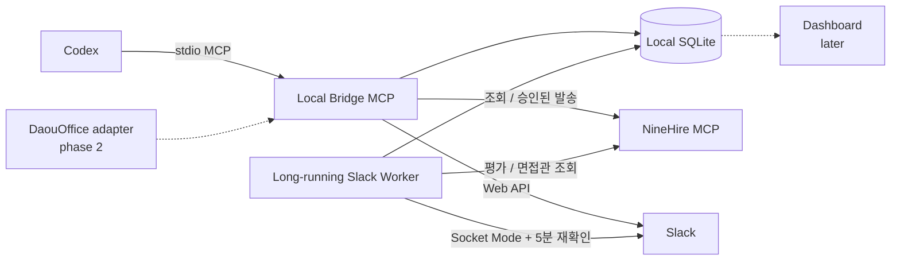

# Interview Arrangement Bridge MCP

현재 파일럿의 자동화 범위와 50개 역할 검토 결과는 [AUTOMATION_REVIEW.md](./AUTOMATION_REVIEW.md)에 정리되어 있습니다. 이 문서는 외부 발송·다우오피스 쓰기처럼 사용자 승인이 필요한 경계를 포함합니다.

실제 시작·중지·복구·백업·민감정보 점검 절차는 [운영 런북](./docs/OPERATIONS_RUNBOOK.md)을 기준으로 합니다.

## 기본 인터뷰 흐름과 운영 사전점검

채용별 기본 흐름은 `approve_recruitment_interview_template`의 `routes`로 승인한다. 흐름은 시작 단계와 포함 단계를 연결하며, 후보자가 시작 단계에 도달했을 때 자동 적용한다.

- `STANDARD`는 한 단계의 60분 인터뷰다.
- `COMBINED`는 여러 단계 면접관이 한 시간에 함께 참석하는 통합 인터뷰다.
- `SEQUENTIAL`은 여러 단계를 같은 날 60분씩 원래 칸반 순서대로 진행한다.

예를 들어 `1차 → 2차` 연속 흐름은 1차를 시작 단계로 둔다. 2차는 별도의 자동 조율 시작 단계로 만들지 않아 중복 조율 건이 생기지 않는다. 다만 나인하이어 참여자 목록만으로는 단계별 실제 면접관을 판별할 수 없으므로, 연속 인터뷰는 Slack 요청 초안 전에 `set_case_sequential_interview_plan`으로 각 단계 참석자를 지정해야 한다.

`get_operational_readiness`는 로컬 DB, 워커, Slack·나인하이어 설정, 마지막 동기화 시각, 다우오피스 전용 브라우저 상태를 점검한다. 기본 조회는 로컬 정보만 읽고, `checkExternal: true`일 때만 Slack 인증과 나인하이어 도구 목록을 읽기 전용으로 확인한다. 다우오피스 로그인 여부는 실제 회의실 동기화 시점에 검증한다.

`get_interview_operations_dashboard`는 기존 운영 현황 외에 인터뷰 방식별 건수, 단계별 면접관 지정이 필요한 연속 인터뷰 건수, 채용별 상태·미응답 집계, 회의실별 로컬 배정 건수와 시간 합계를 반환한다. 로컬 웹 대시보드는 이 구조화된 상태와 이벤트 이력을 기준 데이터로 사용한다.

### 단계별 Slack 안내

연속 인터뷰의 Slack 일정 요청 초안에는 단계별 실제 면접관을 표시한다. 내부 일정 확정 안내 초안에는 각 단계의 시간·회의실·면접관을 표시한다. 단일·통합 인터뷰의 기존 안내 형식과 사용자 승인 후 발송 방식은 유지한다.

새 MCP 도구는 `get_operational_readiness`다.

## 일정 변경과 취소

확정된 인터뷰의 변경과 취소는 나인하이어나 Slack에 자동으로 전송하지 않습니다. 담당자가 MCP에서 전환하고, 생성된 Slack 안내 초안을 검토·승인한 경우에만 발송합니다.

### 일정 재조율

`reopen_interview_schedule_for_reschedule`를 사용합니다.

- `availabilityPolicy: REUSE`는 기존 면접관 가능 시간을 그대로 사용해 새 시간과 회의실을 다시 추천합니다.
- `availabilityPolicy: RECOLLECT`는 기존 가능 시간을 비우고 면접관에게 새 일정 입력 요청을 보냅니다. 이전 Slack 버튼과 모달 응답은 재조율 회차가 달라져 반영되지 않습니다.
- 기존 로컬 인터뷰 회의실 배정과 미발송 안내 초안은 취소합니다. 다우오피스에 미리 잡아 둔 예약 블록은 변경하지 않습니다.
- 이전 최종 일정 안내가 발송된 건이면 `SCHEDULE_CHANGE` 초안이 함께 생성됩니다. `approve_and_send_interviewer_schedule_update`로만 발송합니다.

### 인터뷰 취소

`cancel_interview_arrangement`를 사용합니다.

- 로컬 인터뷰 회의실 배정, 미발송 초안, 미발송 리마인더를 정리하고 건 상태를 `CANCELLED`로 기록합니다.
- 이전 최종 일정 안내가 발송된 건이면 `SCHEDULE_CANCELLATION` 초안이 생성됩니다. 검토 후 `approve_and_send_interviewer_schedule_update`로 발송합니다.
- 두 도구 모두 다우오피스 예약이나 나인하이어의 후보자 일정은 변경하지 않습니다.

나인하이어 후보자 메시지 중 `일정에 불참합니다`는 자동 감지합니다. 단, 이 문구만으로는 인터뷰 포기와 재조율 요청을 구분할 수 없으므로 일정·회의실·Slack 메시지를 자동 변경하지 않고 `CANDIDATE_INTERVIEW_ABSENCE_REVIEW_REQUIRED` 검토 건만 만듭니다.

- `resolve_candidate_interview_absence_review`에서 기존 가능 시간으로 재조율, 면접관 일정 재수집 후 재조율, 취소, 보류를 명시적으로 선택합니다.
- 재조율과 취소는 기존과 같이 Slack 안내 초안만 생성하며, 승인 전에는 발송하지 않습니다.
- `replace_pending_message_draft_text`로 발송 대기 중인 Slack 초안의 문구 하나를 수정할 수 있으며, 수정만으로는 발송되지 않습니다.
- 새 규칙 적용 전의 후보자 메시지는 `reprocess_candidate_interview_absence_notifications`로 다시 처리할 수 있습니다.
- 다른 일정 변경·취소 알림 형식은 실제 사례를 확인한 뒤 별도 감지 규칙을 추가합니다.

## 취소 후 외부 반영 확인

인터뷰를 취소하면 로컬 서버가 나인하이어 후보자 일정을 자동으로 변경하지 않습니다. 대신 나인하이어 처리 확인 항목을 생성해 실제 운영 반영 여부를 기록합니다. 다우오피스 회의실 예약은 인터뷰 취소 후에도 항상 유지합니다.

- `list_cancellation_external_follow_ups`로 나인하이어 일정 확인 대상을 조회합니다.
- `resolve_cancellation_external_follow_up`에서 수동 처리 완료는 `CONFIRMED`, 이미 처리돼 별도 조치가 필요 없으면 `NOT_REQUIRED`로 기록합니다.
- 기존 취소 건은 `backfill_cancellation_external_follow_ups`로 확인 항목을 한 번 생성할 수 있습니다.

## 운영 현황 데이터

`get_interview_operations_dashboard`는 웹 화면 없이 대시보드 구현에 사용할 운영 데이터를 반환합니다. 진행·확정·검토 대기·면접관 미응답·취소 후 나인하이어 확인 대기를 함께 조회하며, 후보자 이름은 로컬 MCP 응답에서만 최소한으로 제공합니다.

나인하이어 취소 확인까지 끝난 취소 건은 기본 운영 현황과 `list_interview_cases` 기본 조회에서 제외합니다. 취소 이력은 `list_interview_cases`에 `status: CANCELLED`를 지정했을 때만 확인합니다. 다우오피스 예약 유지 여부는 취소 후속 상태로 생성하거나 표시하지 않습니다.

## 워커 중단과 가용시간 재제출

Slack 버튼·모달의 가용시간 제출은 채널 메시지 재조회로 복구할 수 없다. 워커는 30초마다 상태 신호를 로컬 DB에 남기며, 마지막 상태 신호 후 90초 이상 지나 재시작하면 중단 구간을 감지한다.

- 가용시간을 수집 중이고 필수 면접관이 아직 미제출인 건마다 `WORKER_DOWNTIME_AVAILABILITY_REVIEW_REQUIRED` 검토 건을 만든다.
- `get_interview_operations_dashboard`의 `summary.worker`에서 워커 상태, 마지막 상태 신호, 마지막 정상 동기화, 최근 중단 구간을 확인할 수 있다.
- `create_availability_recovery_draft`는 미제출 필수 면접관만 멘션하고, 같은 [가능 일정 입력] 버튼이 포함된 재제출 요청 초안을 만든다.
- `approve_and_send_availability_recovery`로 승인·발송할 때만 Slack에 전송하며, 발송 완료 후 해당 중단 검토 건을 해결 처리한다.
- PC가 장시간 꺼져 있거나 작업 스케줄러 재시작 횟수를 모두 소진하면 실시간 제출을 보장할 수 없다. 이 경우에는 대시보드의 `STALE` 상태를 확인하고 재제출 요청 또는 수동 입력으로 처리한다.

## 외부 연동 재시도

Slack 알림 채널 조회와 나인하이어 평가표 조회가 일시적으로 실패하면 로컬 SQLite 대기열에 저장한다. 워커는 대기열을 30초마다 확인하며 한 번에 최대 20건을 순서대로 처리한다.

- 최초 실패 후 1분, 이후 실패마다 2분과 4분 뒤에 다시 시도한다.
- 재시도는 최대 3회이며, 모두 실패한 나인하이어 평가표 조회는 `EVALUATION_LOOKUP_FAILED` 검토 건으로 전환한다.
- Slack 알림 채널 조회가 모두 실패한 경우에는 대시보드의 실패 재시도 항목에서 사유를 확인한 뒤, 워커·Slack 권한·네트워크를 점검한다.
- 원인을 확인한 뒤에는 `retry_integration_job`에 실패 작업 ID를 전달해 사용자가 명시적으로 다음 워커 주기의 재시도를 승인할 수 있다. 이미 대기 중인 작업은 중복 등록하지 않으며, 외부 메시지는 즉시 발송하지 않는다.
- 재시도 대기열은 조회 작업만 처리한다. Slack 메시지 발송은 기존과 같이 사용자 승인 없이는 재시도하거나 자동 발송하지 않는다.
- 승인된 Slack 초안은 발송 직전에 짧은 DB lease를 확보한다. 같은 초안을 동시에 발송하거나 발송 직후 프로세스가 중단되어 재시도하는 경우에도 기존 Slack 메시지를 먼저 찾아 중복 발송을 막는다.

## 다우오피스 전용 브라우저 프로필

다우오피스는 예약을 생성하거나 수정하지 않고, 인터뷰 회의실 예약 블록을 읽는 용도로만 연결한다. 개인 브라우저와 분리된 Google Chrome 프로필을 사용한다.

1. MCP에서 `open_daou_office_login`을 실행하거나 `npm run daou:login`을 실행한다.
2. 새로 열린 Chrome 창에서 다우오피스에 직접 로그인한다. 비밀번호는 `.env`나 소스 코드에 저장하지 않는다.
3. 로그인한 Chrome 창은 열어 둔다. 이후 브리지 서버가 `127.0.0.1`에만 열린 로컬 연결을 통해 예약 화면을 읽는다.

브라우저 프로필은 기본적으로 `data/daou-office-chrome-profile`에 저장되며 Git에서 제외된다. 로그인 세션이 만료되면 같은 전용 Chrome 창에서 다시 로그인하면 된다.

다우오피스 연동은 다음 순서로 사용한다.

1. 회의실 포함 인터뷰 시간 추천을 만들기 직전에 `sync_daou_meeting_room_blocks`로 인터뷰 건의 제안 날짜 예약 블록을 읽는다.
2. `suggest_interview_slots_with_rooms`로 면접관 가능 시간과 회의실을 함께 추천받는다.
3. 사용자가 날짜·시간·회의실을 확인한 뒤에만 `allocate_interview_room_slot`으로 로컬 내부 배정을 확정한다.
4. `confirm_internal_interview_schedule`로 내부 일정 확정을 기록한다. 이때 상태는 `AWAITING_CANDIDATE_CONFIRMATION`이며 후보자에게 확정 안내를 보낸 상태는 아니다.
5. `create_interviewer_schedule_confirmation_draft`로 면접관 안내 초안을 만들고, 검토 후 `approve_and_send_interviewer_schedule_confirmation`으로만 Slack에 발송한다.

내부 배정은 다우오피스의 기존 3시간 예약 블록을 수정하지 않는다. 같은 블록 안에서 1시간 인터뷰 세 건 또는 30분 인터뷰 여섯 건처럼 겹치지 않는 시간만 로컬 DB에 기록한다.
다우오피스 예약과 나인하이어의 후보자 메시지는 이 과정에서 생성·변경하지 않는다.

워커는 로그인된 전용 Chrome 브라우저의 다우오피스 캘린더도 5분 주기로 읽는다. `내 일정(기본)`, `내 일정(강해빈)`, `내 일정(김성은)` 캘린더를 확인하고, 일정명이 `[면접]`으로 시작하며 마지막에 `(후보자명)`이 붙은 일정만 인터뷰 일정으로 해석한다. 로컬에서 추적 중인 후보자의 날짜·시간과 정확히 일치할 때만 `CONFIRMED`로 기록하므로, 나인하이어 발송 완료를 대시보드에 따로 기록하지 않은 경우에도 캘린더 일정 자체를 확정 근거로 사용할 수 있다. 후보자명 중복이나 날짜·시간 불일치는 자동 확정하지 않고 건너뛴다. 이 기능도 다우오피스 캘린더에 일정을 생성·수정·삭제하지 않는다.

나인하이어의 평가 완료 알림을 감지하고, 완료된 평가표 요약을 사용자에게 보여준 뒤 승인된 지원자의 면접관 가용시간을 Slack에서 수집하는 **로컬 업무형 브릿지 MCP 서버**입니다.

Codex는 이 서버의 MCP 도구를 호출하고, 로컬 백그라운드 워커는 Slack Socket Mode 연결·5분 주기 동기화·리마인드를 담당합니다. 상태와 이력은 별도 클라우드 DB 없이 이 PC의 SQLite 파일에 저장됩니다.

> 현재 단계는 **MCP 서버 + Slack 테스트 앱 + 로컬 워커 + 다우오피스 회의실 조회 + 로컬 운영 대시보드**입니다. 후보자에게 나인하이어 일정 제안을 발송하는 작업은 계속 수동으로 처리합니다.

## 로컬 운영 대시보드

대시보드는 이 PC에서만 `127.0.0.1:3100`으로 실행합니다. 외부 배포나 공개 포트는 사용하지 않으며, 브라우저가 SQLite DB에 직접 접근하지 않습니다. Next.js의 로컬 서버가 기존 MCP와 같은 빌드 로직·SQLite DB를 읽어 화면에 제공합니다.

- 운영 보드에서 후보자별 조율 상태를 `검토·조율 시작 → 면접관 일정 수집 → 시간·회의실 검토 → 후보자 응답 대기 → 최종 확정` 순서로 확인합니다.
- 후보자 카드를 열면 인터뷰 유형, 일정·회의실, 면접관 제출 상태, Slack 초안 상태, 업무 이력을 볼 수 있습니다. 나인하이어 원본 평가표나 수동 처리가 필요할 때만 `나인하이어에서 열기`로 해당 후보자를 새 탭에서 확인합니다.
- 회의실 화면은 다우오피스에서 읽어 온 예약 블록과 로컬 인터뷰 배정을 같은 시간표에 표시합니다. 다우오피스 예약을 만들거나 변경하지 않습니다.
- 사용자 판단이 필요한 항목은 선택 모달로 처리합니다. 이 선택은 기존 업무 스킬에 전달되며, Slack·나인하이어 외부 전송은 기존처럼 초안 확인과 별도 승인 없이는 실행되지 않습니다.
- 자연어 AI 도우미는 후속 단계로 보류합니다. 현재는 반복 업무를 선택 카드와 승인 흐름으로 먼저 운영합니다.
- 워커는 작업 스케줄러에서 별도로 계속 실행해야 합니다. 대시보드를 열거나 닫아도 Slack 수신·5분 동기화는 시작되거나 중단되지 않습니다.

### 대시보드의 목적과 화면 원칙

대시보드는 데이터를 많이 보여주는 화면이 아니라, 담당자가 놓치면 안 되는 결정·응답 대기·예외를 1분 안에 파악하고 다음 행동으로 넘어가는 운영 콘솔입니다.

- 홈은 `내가 처리할 일`, `응답 대기`, `예외·오류`, `전체` 큐로 나눕니다. 후보자·채용명·업무를 검색하고 10·25·50건 단위로 페이지를 이동할 수 있습니다.
- 같은 후보자의 같은 큐에 여러 검토가 있으면 한 카드로 묶고, `추가 검토`에서 세부 항목을 펼칩니다. 응답 대기와 예외는 처리 큐와 섞지 않아 우선순위를 오해하지 않도록 합니다.
- 각 카드에는 후보자·채용명, 5단계 조율 진행 표시, 현재 단계, 다음 행동, 단일 승인 버튼을 둡니다. 상세 화면에서만 전체 일정·면접관·메시지·업무 이력을 펼쳐 봅니다.
- 상단 요약에는 내 결정 필요 건수, 응답 대기 건수, 예외 건수, 다가오는 인터뷰, 워커 상태를 표시합니다. 연동이 멈추었는데 후보자 목록만 정상처럼 보이는 상황을 줄이기 위한 장치입니다.
- 외부 연동 확인 상태에는 화면을 연 시각과 별도로 Slack 알림, 나인하이어 일정, 다우오피스 회의실, 다우오피스 인터뷰 캘린더, 워커의 마지막 성공 시각을 표시합니다. 10분 이상 성공 기록이 없으면 최신 확인이 필요한 상태로 표시합니다.
- 회의실 화면은 열정룸 → 행복룸 → 게임체인저 → 의문당 순서를 고정하고, 다우오피스 예약 블록과 로컬 인터뷰 배정을 같은 시간축에 표시합니다. 후보자 상세 화면은 연속 인터뷰의 단계별 시간과 회의실을 모두 보여줍니다.

현재 홈의 페이지 이동은 대시보드가 한 번에 읽어 온 로컬 스냅샷 범위 안에서 동작합니다. 운영 데이터가 수백 건을 넘는 단계에서는 요약·업무 큐·회의실 캘린더를 별도 API로 분리하고 커서 기반 페이지네이션을 추가해야 전체 데이터가 누락되지 않습니다.

### 파일럿 이후 운영 전환 기준

이번 구현에서 대시보드는 분석 그래프를 늘리는 대신 담당자가 다음 행동을 결정하는 운영 콘솔에 집중합니다. 다음 항목은 기능을 더 넣기 위한 목록이 아니라, 다른 채용 담당자와 공유 운영으로 전환하기 전에 반드시 충족해야 하는 안전 기준입니다.

- 대시보드 API에 로그인·역할·CSRF 방어와 실제 승인자 기록을 추가합니다. 현재처럼 한 대의 PC와 `127.0.0.1`에서 한 명이 쓰는 파일럿에서는 의도적으로 보류합니다.
- 워커 단일 실행 lease와 리마인더 발송 claim은 구현했으며 단위 테스트로 중복 선점·만료 복구를 확인했습니다. 실제 Slack·나인하이어·다우오피스 장애 통합 테스트와 작업 스케줄러 중복 실행 리허설은 운영 전환 전에 수행합니다.
- Slack 원문·평가 의견·재시도 payload의 보존 기간과 삭제·백업 암호화 정책을 정합니다. 현재 DB에는 후보자 이름과 평가 의견이 최소 범위로 남으므로 로컬 파일 접근 권한을 제한해야 합니다.
- 대시보드 스냅샷이 200건을 넘으면 서버 커서 페이지네이션과 채용·상태·기간 필터를 먼저 추가합니다. 그 전에는 그래프나 장기 통계보다 누락 없는 운영 큐가 우선입니다.
- 나인하이어 후보자 메일 자동 발송과 다우오피스 예약 생성·취소는 현재 요구사항상 불필요하므로 추가하지 않습니다. 수동 발송·읽기 전용 회의실 동기화·사용자 승인 경계를 유지합니다.

처음 실행하거나 소스를 받은 뒤에는 다음 명령을 실행합니다.

```powershell
npm run build:dashboard
npm run start:dashboard
```

개발 중에는 아래 명령으로 빌드 후 개발 서버를 실행합니다.

```powershell
npm run dev:dashboard
```

브라우저에서 `http://127.0.0.1:3100`을 엽니다. 이 버전은 한 대의 PC에서 담당자 한 명이 사용하는 파일럿 운영용이며, 로그인·권한 분리 기능은 아직 넣지 않았습니다.

## 업무 스킬 계층

반복 업무는 기존 세부 MCP 도구를 대체하지 않고, `인터뷰 업무 스킬` 계층에서 조합합니다. MCP와 이후 대시보드는 같은 스킬과 SQLite 결정 이력을 사용합니다.

- `get_interview_skill_operations`는 운영 현황, 준비 상태, 사용자 선택 대기 항목을 함께 반환합니다.
- 후보자 판정, 면접관 일정 수집, 일정·회의실 확정, 후보자 불참·변경 처리는 각각 선택 가능한 결정으로 생성됩니다.
- 결정에는 `decisionId`, 단일·복수 선택 방식, 옵션, 최소 문맥이 저장됩니다. 미래 대시보드는 이를 버튼·체크박스로 표시하고 선택 결과만 다시 전달하면 됩니다.
- `resolve_interview_skill_decision`은 사용자가 고른 옵션만 처리합니다. Slack 메시지 발송은 기존 초안 검토·승인 도구를 계속 사용합니다.

스킬을 사용할 때도 `상태 확인 → 읽기·동기화 → 사용자 결정 → 초안 검토 → 명시적 발송 승인` 순서를 지킵니다. 스킬은 MCP 도구를 조합하지만 외부 메시지 발송, 후보자 일정 변경, 다우오피스 예약 변경을 자동 승인하지 않습니다.

## 현재 구현 범위

- Slack 비공개 나인하이어 알림 채널을 실시간 수신하고 5분마다 누락 메시지를 재확인
- `서류 평가가 완료되었습니다.`, `평가가 완료되었습니다.`, `평가표 제출이 완료되었습니다.` 알림만 조율 시작 후보로 분류하고, 나인하이어의 실제 평가표 완료 상태를 다시 확인
- 나인하이어 MCP에서 완료된 평가표·평가자·의견·선택 점수를 조회. 가장 최근에 완료된 최종 평가표에서 합격이 하나라도 있으면 검토 대기 건 생성하고, 합격 없이 불합격·보류만 있으면 조율 대상에서 제외
- 저장된 인터뷰 템플릿이 있는 채용은 평가 완료 시점에 채용 칸반 구성 자체가 바뀌었는지 확인. 구성이 바뀌었거나 확인할 수 없으면 템플릿 갱신 검토 건 생성
- 사용자가 MCP에서 인터뷰 유형을 선택해 `인터뷰 조율 시작`을 승인한 경우에만 인터뷰 조율 건 생성. 후보자의 현재 나인하이어 칸반 위치는 시작 조건으로 사용하지 않음
- 사용자가 나인하이어에서 후보자 일정 제안을 수동 발송한 뒤, Slack의 `일정이 확정되었습니다` 알림에서 후보자·채용·날짜·시간이 내부 일정과 일치하면 최종 확정 처리
- `READY_TO_SCHEDULE` 상태에서 사용자가 나인하이어로 직접 확정한 일정은 Slack 확정 알림 또는 5분 주기의 나인하이어 일정 조회로 기록한다. 내부 일정 확정 후 후보자 일정 제안 발송 이력이 있는 `AWAITING_CANDIDATE_CONFIRMATION` 건도 같은 조회 대상에 포함하며, 제안 발송 이력이 없는 대기 건은 후보자 확정으로 간주하지 않는다.
- 직접 확정 일정은 마지막 다우오피스 동기화 데이터를 사용한다. 가능한 인터뷰 회의실이 하나면 로컬 기록에 자동 반영하고, 여러 개면 회의실 선택 대기 항목을 만든다. 동기화 이력이 없거나 가능한 회의실이 없으면 추측하지 않고 검토 대상으로 남긴다.
- `sync_ninehire_confirmed_interview_schedules`를 호출하면 5분 주기를 기다리지 않고 직접 확정 일정을 즉시 다시 확인할 수 있다. 이 조회는 나인하이어·Slack·다우오피스에 변경이나 메시지를 전송하지 않는다.
- 브릿지가 한 번도 추적하지 않은 후보자는 후보자·채용 식별을 안전하게 연결할 근거가 없으므로 자동 기록하지 않는다. 이 경우 `record_manual_confirmed_interview`로 수동 기록한다.
- 이미 내부 배정된 일정은 후보자 확정 알림이 와도 기존 회의실 배정을 유지한다.
- 서버 밖에서 조율되고 후보자 수락까지 끝난 일정은 `record_manual_confirmed_interview`로 수동 최종 확정 이력에 기록. Slack·나인하이어·다우오피스에는 변경을 전송하지 않음
- Slack 알림의 장소는 회사 주소로 보존하며 회의실 일치 조건에는 사용하지 않음. 후보자·채용 식별 또는 날짜·시간이 다르면 자동 확정하지 않고 검토 대기 처리
- 나인하이어 채용 참여자 중 개별 사용자를 면접관 후보로 동기화하고, 건별로 추가·제외·필수/선택 변경
- 후보는 기본적으로 필수 면접관으로 표시하며, Slack 요청 초안 전 사용자가 필요한 경우 선택 참여 또는 제외로 조정
- 자동 연결 실패 시 나인하이어 사용자 ID와 Slack 사용자 ID를 한 번 수동 매핑
- 건별 면접관 추가·제외·필수/선택 참여 변경
- Slack 발송 전 메시지 초안 생성 → 사용자 승인 → 테스트 채널 발송
- Slack 모달에서 다음 항목 선택
  - 모든 제안 날짜·시간 가능
  - 날짜별 모든 시간 가능
  - 날짜별 `09:00–10:00`부터 `17:00–18:00`까지 1시간 단위
- 기본 인터뷰 60분, 건별 소요시간·제안 날짜 변경
- 1시간 단위로 표현할 수 없는 시간은 MCP 도구로 수동 기록
- 필수 면접관 가용시간의 교집합과 건별 소요시간을 반영한 후보 시간 계산
- 미응답자에게 2영업시간 후 1차, 다음 영업일 10:00에 2차 리마인드
- 2차 리마인드 뒤 담당자 검토 대기 전환
- 중복 이벤트 방지, 상태 이력, 검토 대기 사유, 메시지 발송 상태 저장
- 워커 중단 감지와 미제출 면접관 대상 재제출 요청 초안

## 채용별 인터뷰 단계 템플릿

나인하이어의 채용 칸반 단계는 `get_recruitment.steps`에서 제목·순서·현재 인원 수와 함께 읽는다. `preview_recruitment_interview_template`로 초안을 확인한 뒤 `approve_recruitment_interview_template`에서 실제 인터뷰 단계만 승인한다.

- 승인된 기본 인터뷰 시간은 60분이다. 단계별로 명시한 소요시간은 그 값을 사용하며, 예를 들어 B2B AI 강사 채용의 `면접 및 시강`은 30분으로 승인할 수 있다.
- `CEO와의 대화`는 60분 CEO 인터뷰로 제안한다.
- `실무자 + HR 인터뷰`, `실무자 + 임원 인터뷰`처럼 통합 인터뷰인 경우 `COMBINED`로 제안한다. 이는 모든 참석 면접관이 한 시간에 함께 진행하는 단일 인터뷰다.
- 템플릿은 나인하이어 채용 ID에 연결한다. 칸반 구성이 바뀌면 미리 보기 결과가 `requiresApproval: true`가 되어 재승인을 요구한다.
- 평가 완료 후보자의 조율 시작 승인에서는 현재 후보자 칸반이 아니라 승인된 템플릿 경로를 선택한다. 경로가 하나면 시작·보류만 선택하고, 여러 경로면 1차·2차·CEO·통합·연속 등 실제 인터뷰 유형 중 하나를 선택한다.
- 과거 버전에서 인터뷰 계획 없이 생성된 로컬 건은 `apply_case_interview_template_route`로 템플릿 경로를 한 번 적용할 수 있다. Slack과 나인하이어에는 변경을 보내지 않는다.
- 후보자별 긴급 예외는 `set_case_combined_interview_plan`으로 설정한다. 두 단계 이상을 60분으로 통합하고, 이번 후보자에게 실제로 참석할 면접관만 필수로 지정한다.
- 통합 예외는 면접관 일정 요청을 보내기 전까지만 변경할 수 있으며, 나인하이어의 단계 이동이나 합격 처리는 자동으로 변경하지 않는다.

### 같은 날 연속 인터뷰

1차와 2차처럼 여러 단계를 같은 날 이어서 진행해야 하면 `set_case_sequential_interview_plan`으로 원래 진행 순서와 단계별 실제 참석 면접관을 설정한다.

- 각 단계는 60분이며, 1차 면접관과 2차 면접관의 가용시간은 각각 독립적으로 계산한다. 어느 한 면접관에게 2시간 연속 가능 시간을 요구하지 않는다.
- `suggest_sequential_interview_slots_with_rooms`는 기본 순서인 1차 → 2차 조합을 먼저 찾는다. 이 순서가 가능한 시간과 회의실 조합을 하나도 만들 수 없을 때만 2차 → 1차 역순을 제안한다.
- 같은 회의실에서 연속 진행할 수 있는 경우를 우선한다. 같은 방이 없으면 1차 `행복룸 13:00–14:00`, 2차 `열정룸 14:00–15:00`처럼 단계별로 다른 인터뷰 회의실을 연달아 사용할 수 있다.
- 사용자가 추천안을 확인한 뒤 `allocate_sequential_interview_room_slots`로 각 단계의 회의실을 로컬에 배정하고, `confirm_sequential_interview_schedule`로 내부 일정을 확정한다. 이 과정도 다우오피스 예약과 후보자 연락을 변경하지 않는다.
- 배정 결과에는 단계, 시간, 회의실을 모두 저장한다. 재조율 또는 취소 시에는 모든 단계의 로컬 배정을 함께 해제하지만, 다우오피스의 원래 예약 블록은 유지한다.

## 중요한 범위 구분

나인하이어 공식 설명에 따르면 지원자 단계 이동, 불합격 처리, 안내 메일 발송, 인터뷰 일정 조율 같은 규칙 기반 작업은 나인하이어 MCP가 아니라 나인하이어 워크플로우 자동화의 범위입니다. 따라서 이 프로젝트는 다음처럼 역할을 나눕니다.

- **나인하이어 MCP:** 평가 결과·면접관 등 채용 데이터 조회
- **Slack 앱:** 면접관에게 가능한 시간 요청, 응답 수집, 리마인드
- **로컬 브릿지 MCP:** 두 시스템 사이의 업무 규칙·승인·상태·이력 관리
- **나인하이어 워크플로우 또는 담당자 수동 처리:** 후보자 단계 이동, 불합격 처리, 안내 메일 등. 현재 브릿지 MCP는 나인하이어 칸반을 변경하지 않는다.

참고: [나인하이어 MCP 공식 소개와 FAQ](https://blog.ninehire.com/tip-ai-recruitment-mcp)

## 구조



MCP 프로세스와 워커를 나눈 이유는 명확합니다. Codex가 실행하는 stdio MCP 프로세스는 대화 세션에 종속될 수 있지만 Slack 버튼·모달은 언제든 들어옵니다. 따라서 Slack 워커는 PC에서 계속 실행되어야 합니다.

## 선택한 방식과 대안

| 항목 | 선택 | 장점 | 단점 / 대안 |
|---|---|---|---|
| Slack 연결 | Socket Mode | 공개 URL·포트 포워딩 없이 로컬 PC에서 이벤트와 버튼 처리 가능 | PC와 워커가 켜져 있어야 함. 서버 배포 시 HTTP Events API가 운영 관측성에 유리 |
| 저장소 | 로컬 SQLite | 별도 DB 구축·비용 없음, 백업이 단순함 | 한 PC에 종속. 다중 사용자·고가용성이 필요해지면 PostgreSQL이 적합 |
| 나인하이어 도구 연결 | 실행 시 실제 스키마 검사 후 환경변수 매핑 | 존재하지 않는 도구명이나 필드를 추측하지 않음 | 최초 1회 매핑 필요. 도구 스키마가 확정되면 코드 어댑터로 고정하는 방법도 가능 |
| 면접관 관리 | 나인하이어를 원본으로 건별 동기화, 로컬은 ID 매핑·예외만 보관 | 면접관 변경 시 전역 목록을 매번 수동 수정하지 않음 | 나인하이어 도구가 면접관을 반환하지 않으면 건별 수동 추가 필요 |
| Slack 발송 | 초안 → 명시적 승인 → 발송 | 잘못된 대상·내용의 자동 발송을 방지 | 완전 자동 발송보다 한 단계 더 필요 |

## 요구 환경

- Windows 10/11
- Node.js 24 이상
- 나인하이어 Enterprise 요금제와 MCP 키
- 새 Slack 앱을 워크스페이스에 설치해 줄 관리자
- 앱을 초대할 비공개 채널 2개
  - 나인하이어 알림을 읽는 원본 채널
  - 면접관 요청을 보낼 테스트 채널

현재 프로젝트는 Node 24 내장 `node:sqlite`를 사용합니다. 실행 시 experimental 경고가 나올 수 있지만 이 프로젝트의 테스트 대상인 Node 24에서 동작합니다. 장기 운영에서 Node 내장 SQLite 안정성 정책이 맞지 않으면 `better-sqlite3` 또는 PostgreSQL 어댑터로 교체할 수 있습니다.

## 빠른 시작

### 1. 설치와 빌드

```powershell
cd C:\Users\user\Desktop\codex-mcp
npm install
Copy-Item .env.example .env
npm run build
npm test
npm run check:repo
```

실제 키는 반드시 `.env`에만 넣습니다. `.env`, SQLite DB, WAL 파일은 Git에서 제외되어 있습니다.

### 2. 새 Slack 앱 만들기

1. [Slack 앱 관리](https://api.slack.com/apps)에서 **Create New App → From an app manifest**를 선택합니다.
2. 워크스페이스를 고른 뒤 [`slack-app-manifest.yaml`](./slack-app-manifest.yaml)의 내용을 붙여 넣어 앱을 생성합니다.
3. **Basic Information → App-Level Tokens**에서 토큰을 만들고 `connections:write` 범위를 부여합니다.
   - 발급된 `xapp-...` 값을 `.env`의 `SLACK_APP_TOKEN`에 입력합니다.
4. 관리자에게 앱 설치를 요청합니다.
   - 설치 후 Bot User OAuth Token `xoxb-...`를 `SLACK_BOT_TOKEN`에 입력합니다.
5. Slack에서 앱을 두 비공개 채널 모두에 초대합니다.
   - 원본 나인하이어 알림 채널
   - 분리된 인터뷰 요청 테스트 채널
6. 두 채널의 채널 ID를 `.env`에 입력합니다.
   - `SLACK_SOURCE_CHANNEL_ID`
   - `SLACK_REQUEST_CHANNEL_ID`

Manifest에 포함된 권한은 다음과 같습니다.

| 권한 / 이벤트 | 용도 |
|---|---|
| `groups:history` | 앱이 참여한 비공개 원본 채널 메시지 읽기 |
| `message.groups` | 비공개 채널 신규 메시지 이벤트 수신 |
| `chat:write` | 승인된 요청과 리마인드 발송 |
| `users:read`, `users:read.email` | 나인하이어 면접관 이메일을 Slack 사용자 ID로 연결 |
| `connections:write` | App-Level Token에서 Socket Mode 연결 |

Socket Mode는 공개 요청 URL 없이 이벤트와 상호작용을 받을 수 있습니다. 참고: [Slack Socket Mode 공식 문서](https://docs.slack.dev/apis/events-api/using-socket-mode/)

#### 나인하이어 Slack 앱의 `bot_id` 확인

토큰과 원본 채널 ID를 입력한 뒤 다음 명령을 실행합니다.

```powershell
npm run inspect:slack-source
```

출력에는 본문 전체 대신 최근 메시지의 `botId`, 제목, 분류 결과만 표시됩니다. 나인하이어 알림의 `botId`를 `.env`의 `SLACK_NINEHIRE_BOT_ID`에 넣으세요.

`SLACK_NINEHIRE_BOT_ID`를 비워도 전용 테스트 채널에서는 작동하지만, 같은 채널의 다른 앱 메시지도 로컬 파서가 읽게 됩니다. 운영 전에는 반드시 설정하는 것을 권장합니다.

### 3. 나인하이어 MCP 연결 확인

`.env`에 MCP URL과 키를 입력합니다.

```dotenv
NINEHIRE_MCP_URL=https://api.ninehire.com/developer/mcp
NINEHIRE_MCP_API_KEY=실제_키
NINEHIRE_MCP_AUTH_HEADER=Authorization
NINEHIRE_MCP_AUTH_SCHEME=Bearer
NINEHIRE_MCP_TIMEOUT_MS=30000
```

인증 헤더·스킴은 나인하이어 설정 화면이 제공하는 연결 예시와 반드시 대조하세요. 이 저장소에는 실제 키를 넣지 않습니다.
키를 스킴 없이 보내라는 안내를 받은 경우 `NINEHIRE_MCP_AUTH_SCHEME=`처럼 빈 값으로 둡니다.

다음 명령은 나인하이어 도구를 실행하지 않고 도구명과 스키마만 조회합니다.

```powershell
npm run inspect:ninehire
```

현재 서버는 나인하이어의 실제 읽기 도구인 `get_recruitments`, `get_applicant_progresses`, `get_applicant_progress`를 사용합니다. Slack 알림의 지원자·채용 링크를 우선 사용하고, 링크 ID를 쓸 수 없으면 이름이 정확히 하나만 일치할 때만 보완 조회합니다.

완료된 평가표는 평가 방식, 완료 시각, 평가 참여자, 평가자별 전체 의견, 항목별 선택값과 점수를 요약해 로컬 검토 건에 저장합니다. 이름이나 채용명이 중복되거나 완료된 평가표를 찾지 못하면 자동으로 인터뷰 조율을 시작하지 않고 검토 사유만 남깁니다.

`list_workflow_reviews`로 평가 요약을 확인한 뒤, 승인된 템플릿의 `routeTriggerStepId`를 지정해 `approve_interview_arrangement`를 호출하면 인터뷰 조율 건이 생성됩니다. 이 승인 단계에서는 Slack 메시지가 발송되지 않으며 나인하이어 칸반도 이동하지 않습니다.

### 4. 로컬 워커 실행

개발 중:

```powershell
npm run dev:worker
```

빌드 결과 실행:

```powershell
npm run build
npm run start:worker
```

워커가 하는 일:

- Socket Mode로 Slack 메시지·버튼·모달 수신
- 시작 직후 및 5분마다 `conversations.history` 재확인
- 평가 완료 알림의 나인하이어 평가 결과 조회
- 면접관 응답 저장
- 미응답 리마인드 발송

PC가 절전·종료되거나 워커가 꺼져 있으면 실시간 버튼 처리와 5분 재확인은 멈춥니다. 다시 시작하면 마지막 Slack 타임스탬프 이후 메시지를 재확인합니다.

Windows 로그인 시 자동 시작과 수동 복구는 [운영 런북](./docs/OPERATIONS_RUNBOOK.md)의 `manage-worker-task.ps1` 절차를 사용합니다. 작업 스케줄러 상태만 보지 말고 대시보드 또는 `bridge_status`에서 heartbeat와 마지막 성공 주기도 함께 확인합니다.

### 5. 로컬 운영 대시보드 실행

워커 자동 시작과는 별개로, 화면을 볼 때만 로컬 웹 서버를 실행합니다.

```powershell
npm run build:dashboard
npm run start:dashboard
```

브라우저에서 `http://127.0.0.1:3100`을 열어 운영 보드, 회의실 시간표, 후보자별 조율 이력을 확인합니다. 서버는 `127.0.0.1`에만 바인딩하므로 같은 사내망의 다른 PC에서는 접근할 수 없습니다.

### 6. Codex에 로컬 MCP 등록

먼저 빌드합니다.

```powershell
npm run build
```

프로젝트별 `.codex/config.toml` 또는 사용자 Codex 설정의 `mcp_servers`에 다음과 같이 등록합니다. 경로는 실제 저장 위치에 맞게 수정하세요.

```toml
[mcp_servers.interview_bridge]
enabled = true
required = true
command = "node"
args = ["dist/src/mcp/main.js"]
cwd = "C:/Users/user/Desktop/codex-mcp"
startup_timeout_sec = 10.0
tool_timeout_sec = 60.0
```

공식 Codex 설정은 stdio MCP에 `command`, `args`, `cwd`를 둘 수 있고, 프로젝트 설정은 `.codex/config.toml`에 둘 수 있습니다. 설정 후 Codex 세션을 새로 시작해 도구 목록을 갱신하세요.

## 일반 사용 흐름

1. 워커가 Slack 원본 채널에서 평가 완료 알림을 감지합니다.
2. 나인하이어에서 완료된 평가표 요약을 조회해 검토 대기 건에 저장합니다.
3. Codex에 “검토 대기 평가표를 보여줘”라고 요청합니다.
4. 평가표를 검토하고 승인된 인터뷰 유형을 선택해 `approve_interview_arrangement`로 인터뷰 조율 시작을 승인합니다.
5. 면접관과 소요시간·제안 날짜를 확인합니다.
6. “이 건의 Slack 요청 초안만 만들어서 보여줘”라고 요청합니다.
7. 초안의 대상·날짜·내용을 확인합니다.
8. “이 초안을 승인하고 테스트 채널에 보내줘”라고 명시적으로 요청합니다.
9. 면접관은 Slack 버튼과 모달로 가용시간을 제출합니다.
10. Codex에서 인터뷰 건 상세를 조회해 공통 가능시간을 검토합니다.

여러 완료 평가표가 있으면 가장 최근에 완료된 최종 평가표의 최종 평가 항목만 봅니다. 그 평가표에서 평가자 중 한 명이라도 합격이면 검토 대기 건을 만들고, 합격 없이 불합격·보류만 있으면 조율 대상에서 제외합니다. 최신 완료 시각을 판단할 수 없거나 그 밖의 표현이면 자동으로 제외하지 않고 `EVALUATION_DECISION_REQUIRED` 검토 건으로 남깁니다. 조율 대상은 `list_workflow_reviews`에서 평가 요약과 인터뷰 유형을 확인한 뒤에만 `approve_interview_arrangement`로 인터뷰 조율을 시작할 수 있습니다.

## 제공 MCP 도구

| 도구 | 역할 | 외부 변경 |
|---|---|---|
| `bridge_status` | 연결 설정 및 로컬 상태 요약 | 없음 |
| `list_interview_cases` | 인터뷰 건 목록 | 없음 |
| `get_interview_case` | 면접관·가용시간·초안 상세 | 없음 |
| `suggest_common_interview_slots` | 필수 면접관 공통 가능시간 계산 | 없음 |
| `list_workflow_reviews` | 사람 판단이 필요한 항목 | 없음 |
| `list_in_progress_recruitments` | 진행 중인 나인하이어 채용 목록과 마감 정보 조회 | 외부 읽기 |
| `list_closed_recruitments` | 종료된 나인하이어 채용 목록과 종료 시각 조회 | 외부 읽기 |
| `preview_recruitment_interview_template` | 나인하이어 칸반 단계와 승인 필요 여부 확인 | 외부 읽기 |
| `approve_recruitment_interview_template` | 채용별 인터뷰 단계·통합 여부·기본 60분 규칙 저장 | 로컬 상태 갱신 |
| `get_recruitment_interview_template` | 승인된 채용별 인터뷰 단계 규칙 조회 | 없음 |
| `inspect_ninehire_tools` | 나인하이어 도구 스키마 조회 | 읽기 |
| `sync_slack_notifications` | Slack 원본 채널 즉시 재확인 | 외부 읽기, 로컬 상태 갱신 |
| `list_integration_retry_jobs` | Slack·나인하이어 재시도 대기·실패 현황 조회 | 없음 |
| `retry_integration_job` | 원인 확인 후 실패한 연동 작업을 다음 워커 주기에 재시도하도록 승인 | 로컬 재시도 대기열 갱신 |
| `reprocess_interview_arrangement_eligibility_reviews` | 기존 평가 검토 건을 합격 기준으로 재판정 | 로컬 상태 갱신 |
| `reprocess_schedule_confirmation_notifications` | 기존 일정 확정 Slack 알림 재처리 | 로컬 상태·이벤트 갱신 |
| `approve_interview_arrangement` | 평가표 검토 후 승인된 인터뷰 유형으로 조율 시작 | 로컬 상태 갱신 |
| `apply_case_interview_template_route` | 과거에 계획 없이 생성된 로컬 건에 템플릿 경로 적용 | 로컬 상태 갱신 |
| `record_manual_confirmed_interview` | 서버 밖에서 최종 확정된 인터뷰 일정 기록 | 로컬 상태·이력 갱신 |
| `resolve_interviewer_review` | 면접관 교체·제외 등 조치 후 검토 완료 | 로컬 상태 갱신 |
| `sync_case_interviewers` | 나인하이어 채용 참여자를 면접관 후보로 반영 | 외부 읽기, 로컬 상태 갱신 |
| `map_interviewer_to_slack` | 나인하이어–Slack ID 매핑 | 로컬 상태 갱신 |
| `add_case_interviewer` | 이번 건에 면접관 추가 | 로컬 상태 갱신 |
| `exclude_case_interviewer` | 이번 건에서 면접관 제외 | 로컬 상태 갱신, 이력 보존 |
| `set_interviewer_required` | 필수/선택 면접관 변경 | 로컬 상태 갱신 |
| `set_case_schedule_rules` | 소요시간·제안 날짜 변경 | 로컬 상태 갱신 |
| `set_case_combined_interview_plan` | 후보자별 통합 인터뷰와 실제 참석 면접관 지정 | 로컬 상태 갱신 |
| `set_case_sequential_interview_plan` | 후보자별 같은 날 연속 인터뷰의 단계·단계별 면접관 지정 | 로컬 상태 갱신 |
| `record_manual_availability` | 예외 시간 직접 기록 | 로컬 상태 갱신 |
| `create_availability_recovery_draft` | 워커 중단 후 미제출 면접관 재요청 초안 생성 | 발송 없음 |
| `create_interviewer_request_draft` | Slack 메시지 초안 생성 | 발송 없음 |
| `suggest_sequential_interview_slots_with_rooms` | 단계별 가용시간, 정상·역순, 동일·분리 회의실을 반영한 연속 인터뷰 추천 | 없음 |
| `allocate_sequential_interview_room_slots` | 연속 인터뷰의 단계별 회의실 시간대 로컬 배정 | 로컬 상태 갱신 |
| `confirm_internal_interview_schedule` | 회의실 배정 기반 내부 일정 확정 | 로컬 상태·이벤트 갱신 |
| `confirm_sequential_interview_schedule` | 단계별 회의실 배정 기반 연속 인터뷰 내부 일정 확정 | 로컬 상태·이벤트 갱신 |
| `create_interviewer_schedule_confirmation_draft` | 면접관 최종 일정 안내 초안 생성 | 발송 없음 |
| `list_pending_message_drafts` | 승인 대기 초안 조회 | 없음 |
| `approve_and_send_interviewer_request` | 초안 승인 후 Slack 발송 | **Slack 메시지 발송** |
| `approve_and_send_availability_recovery` | 재제출 요청 승인 후 Slack 발송 | **Slack 메시지 발송** |
| `approve_and_send_interviewer_schedule_confirmation` | 최종 일정 안내 승인 후 Slack 발송 | **Slack 메시지 발송** |

## 날짜와 리마인드 규칙

PDF의 날짜 제안 규칙을 그대로 코드화했습니다.

- 요청일이 월요일이면 이번 주 목요일 + 다음 주 월~목, 총 5일
- 그 외에는 다음 주 월~목, 총 4일
- 기본 시간대 09:00–18:00
- 기본 소요시간 60분

리마인드는 주말을 제외한 09:00–18:00 업무시간으로 계산합니다.

- 1차: 요청 후 업무시간 기준 2시간
- 2차: 다음 영업일 10:00
- 1차와 2차 시간이 겹치거나 역전되면 중복 발송을 피하기 위해 2차를 1차 다음 영업일 10:00으로 이동
- 최대 2회 후 담당자 검토 대기

현재는 **공휴일 캘린더를 적용하지 않고 토·일만 제외**합니다. 회사 공휴일·대체휴무까지 반영하려면 다음 단계에서 휴일 캘린더 어댑터가 필요합니다.

## 로컬 데이터

기본 DB 위치:

```text
data/bridge.db
```

주요 저장 대상:

- Slack 알림의 해시·분류·최소 식별 정보
- 인터뷰 조율 건 상태
- 건별 면접관 스냅샷과 Slack ID 매핑
- 면접관 가용시간
- 메시지 초안·승인·발송 상태
- 리마인드 상태
- 검토 대기 사유와 감사 이벤트

원본 Slack 이벤트 전체를 장기 보관하지 않고, 파싱에 필요한 텍스트와 링크만 축약 저장합니다. 그래도 지원자 이름 등 개인정보가 포함될 수 있으므로 DB를 Git·공유 폴더·개인 클라우드 동기화 대상에 넣지 마세요.

워커가 실행 중인 날에는 SQLite 안전 백업 방식으로 하루 한 번 `data/backups/bridge-YYYY-MM-DD.db`를 생성하고, 최근 14개만 유지합니다. WAL 모드 DB를 파일 복사로 백업하면 데이터가 일관되지 않을 수 있으므로 이 방식을 사용합니다.

필요하면 아래 명령으로 수동 백업도 만들 수 있습니다.

```powershell
npm run backup:db
```

## Windows에서 워커 자동 시작

작업 스케줄러에는 “5분마다 짧게 실행”하는 작업이 아니라 **로그인 시 장기 실행 워커를 시작하고 실패 시 재시작**하도록 등록해야 합니다. 버튼과 모달 이벤트는 5분 작업 사이에도 들어오기 때문입니다.

권장 설정:

- 트리거: 사용자 로그인 시
- 프로그램: Node.js 실행 파일, 일반적으로 `C:\Program Files\nodejs\node.exe`
- 인수: `dist\src\worker\main.js`
- 시작 위치: `C:\Users\user\Desktop\codex-mcp`
- 실패 시 1분 간격 재시작, 3회 이상
- 가능한 경우 “예약된 시작을 놓친 경우 가능한 즉시 실행”
- 절전 중 실행 여부는 회사 PC 정책에 맞게 결정

먼저 터미널에서 `npm run start:worker`가 정상 동작하는지 확인한 뒤 작업 스케줄러에 등록하세요.

## 상태 흐름

```text
Slack 평가 완료 알림
  ├─ 지원자·채용·완료 평가표 확인 불가 → REVIEW_REQUIRED
  └─ 최종 평가 확인
       ├─ 합격 1명 이상 → START_APPROVAL_REQUIRED
       │                      ↓ 사용자 인터뷰 유형 선택·승인
       │                  READY_FOR_DRAFT
       │                      ↓ 초안 생성
       │                  DRAFT_CREATED
       │                      ↓ 사용자 승인·발송
       │            COLLECTING_AVAILABILITY
       ├─ 합격 없이 불합격·보류만 → 조율 대상 제외
       └─ 결과 판단 불가 → EVALUATION_DECISION_REQUIRED
       │            ├─ 면접관 불참/미응답 → REVIEW_REQUIRED
       │            └─ 필수 면접관 모두 제출 → READY_TO_SCHEDULE
                                                            ↓ 회의실 내부 배정·일정 확정
                                       AWAITING_CANDIDATE_CONFIRMATION
                                                            ↓ 면접관 안내 초안 검토·승인
                                       Slack 내부 일정 안내 발송
```

면접관이 “이번 인터뷰 참여 어려움”을 누르면 자동 제외하지 않습니다. `DECLINED_PENDING_REVIEW`로 저장하고 담당자가 대체 면접관 추가, 선택 참여 전환, 제외 중 하나를 결정합니다.

## 개발 명령

```powershell
npm run dev:mcp
npm run dev:worker
npm run dev:dashboard
npm run build:dashboard
npm run start:dashboard
npm run backup:db
npm run inspect:ninehire
npm run inspect:slack-source
npm run check:repo
npm run typecheck
npm test
npm run build
```

## 테스트

현재 자동 테스트는 다음 핵심 규칙을 검증합니다.

- 월요일/비월요일 날짜 제안 규칙
- 가용시간 중복 제거와 연속 시간 병합
- 업무시간·주말을 고려한 리마인드
- 평가 완료와 평가 기한 만료 메시지 구분
- Slack 링크에서 지원자·채용 정보 추출
- 날짜별 체크박스가 Slack 제한인 10개 이하인지 확인
- Slack 메시지 중복 저장 방지
- 제외된 면접관 이력 보존

실제 Slack/NineHire 키를 사용하는 통합 테스트는 비밀값과 외부 상태 변경 위험 때문에 자동 테스트에 포함하지 않았습니다. 테스트 채널에서 다음 순서로 수동 검증하세요.

1. `npm run inspect:ninehire`
2. `npm run inspect:slack-source`
3. 워커 시작
4. `bridge_status`
5. `sync_slack_notifications`
6. 초안 생성
7. 초안 내용 확인 후 승인·발송
8. 테스트 면접관 계정으로 모달 제출
9. `get_interview_case`로 저장 결과 확인

운영 스크립트·백업·민감정보 점검은 [운영 런북](./docs/OPERATIONS_RUNBOOK.md)을 따릅니다. 실제 키를 사용하는 통합 테스트는 자동화하지 않으며, 테스트 채널에서 대상과 메시지를 확인한 뒤 수동으로 진행합니다.

## 알려진 제한과 다음 단계

- 다우오피스는 지정 인터뷰 회의실·예약자·이용 목적이 일치하는 예약 블록만 읽습니다. 다만 현재 이용 목적 값은 다우오피스의 실제 값인 `면접`으로 판별합니다. 예약 생성·수정·취소는 지원하지 않습니다.
- 후보자에게 인터뷰 일정을 생성하거나 메시지를 발송하는 나인하이어 MCP 도구는 현재 확인되지 않았습니다. 후보자 확인은 나인하이어에서 수동으로 처리하고 후속 단계에서 결과를 기록해야 합니다.
- 대시보드는 현재 로컬 단일 운영자용입니다. 여러 담당자가 동시에 사용하려면 중앙 서버, 공유 DB, 로그인·권한 관리, 비밀값 관리 구조로 전환해야 합니다.
- 나인하이어가 실제 제공하는 도구 스키마를 키 없이 확인할 수 없으므로 최초 매핑은 필요합니다.
- Slack 알림 Block Kit 원본 형식이 바뀌면 파서 fixture를 추가하고 `src/slack/parser.ts`를 조정해야 합니다.
- 공휴일은 아직 제외하지 않습니다.
- 한 대의 로컬 PC를 기준으로 설계했습니다. 여러 운영자가 동시에 쓰거나 24시간 가용성이 필요하면 서버 배포와 PostgreSQL 전환을 검토해야 합니다.

## GitHub에 올리기 전 확인

다음 파일은 커밋하면 안 됩니다.

- `.env`
- `data/*.db`
- `data/*.db-wal`
- `data/*.db-shm`
- 로그와 실제 나인하이어 도구 응답

확인 명령:

```powershell
git status
git diff -- . ':!.env'
```

저장소가 아직 초기화되지 않았다면:

```powershell
git init
git add .
git commit -m "feat: scaffold local interview arrangement bridge MCP"
```

그 다음 본인이 만든 GitHub 원격 저장소 URL을 연결해 푸시하세요. 이 프로젝트는 라이선스를 아직 선택하지 않았으므로 공개 저장소로 배포할 계획이라면 회사 정책에 맞는 라이선스와 개인정보 처리 방침을 먼저 결정해야 합니다.
